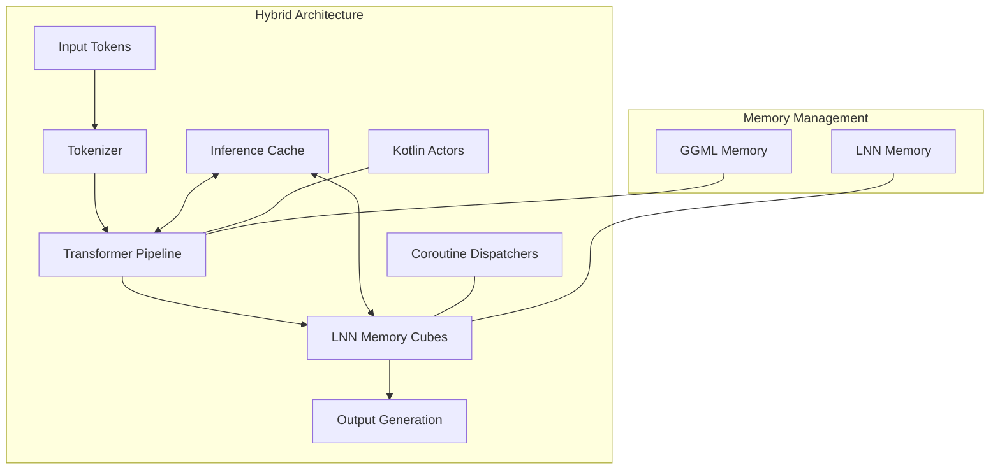
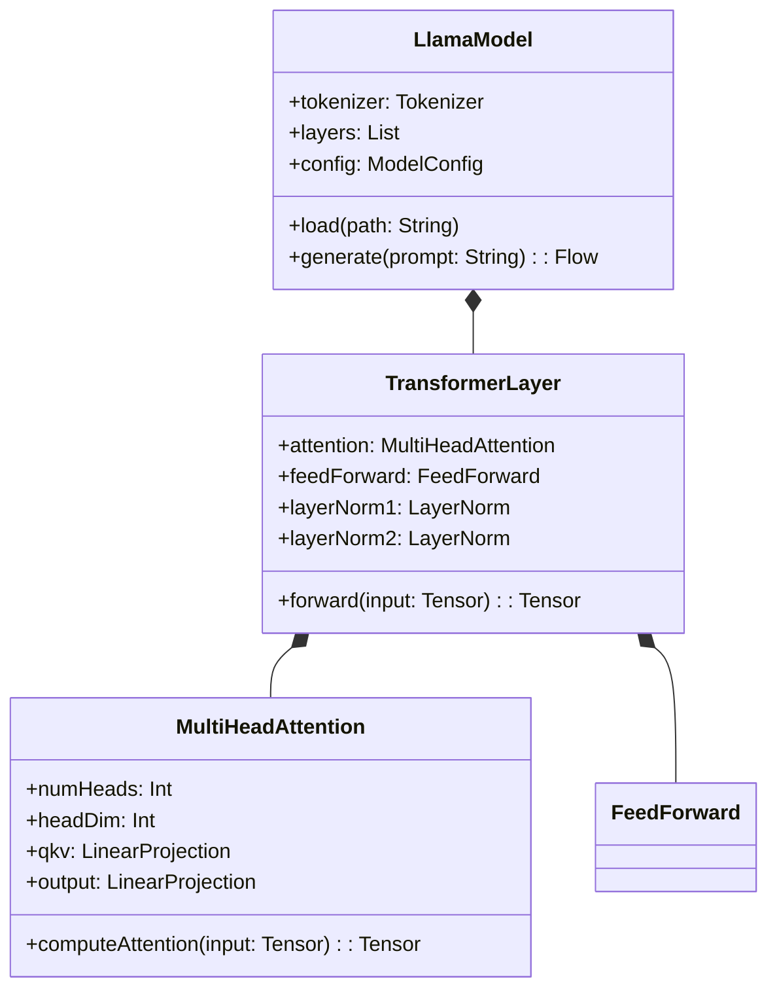
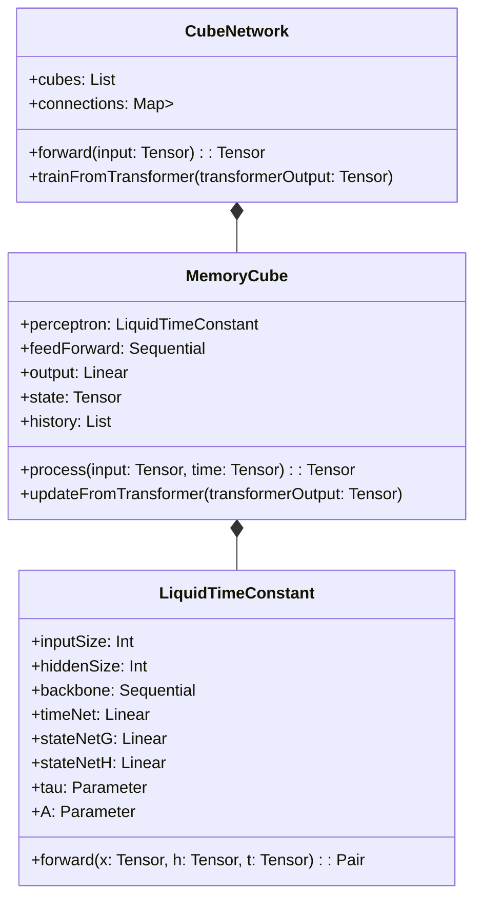
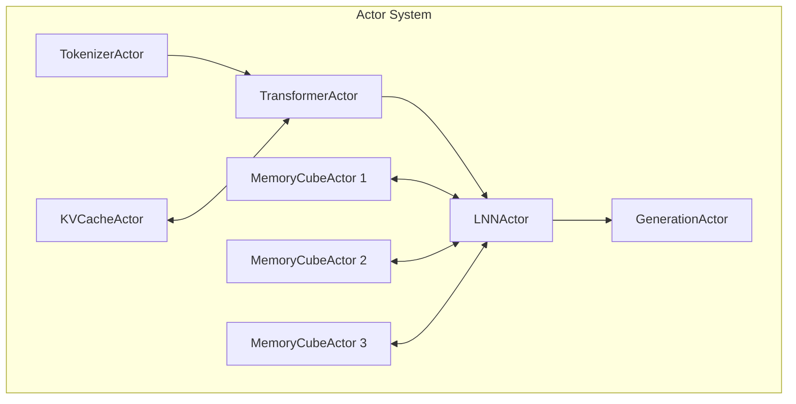
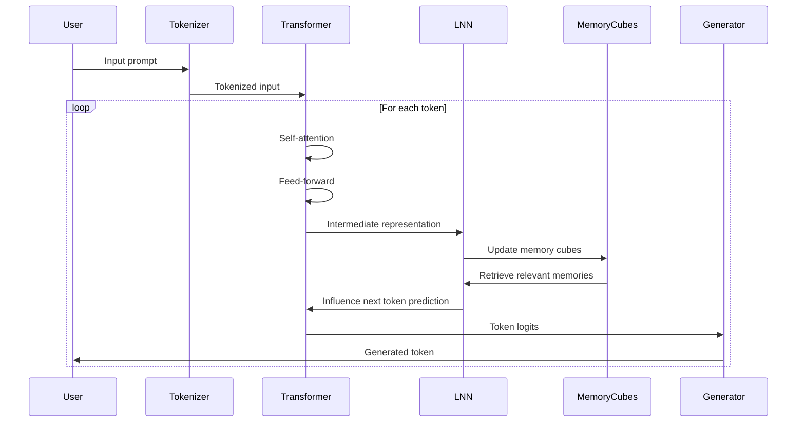
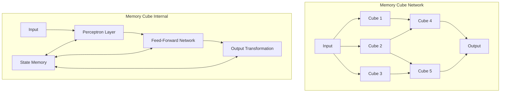
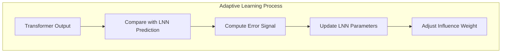

# Hybrid Llama.cpp and Liquid Neural Networks: A Kotlin Native Design

## Introduction

This document presents a design for blending Llama.cpp with Liquid Neural Networks (LNN) to create a hybrid architecture that is Kotlin native and actor/coroutine friendly. The design leverages the strengths of both approaches:

1. **Llama.cpp**: Efficient inference of large language models with minimal dependencies
2. **Liquid Neural Networks**: Dynamic, continuous-time neural computation with adaptive time constants

The resulting architecture enables a system that combines the parallel processing capabilities of Transformers with the adaptive dynamics of LNNs, all implemented in idiomatic Kotlin with full support for coroutines and actors.

## Core Design Principles

1. **Actor-based computation**: Use Kotlin's actor model for parallel processing and message passing
2. **Coroutine-friendly API**: Design all operations to be suspension-friendly and non-blocking
3. **Memory cube architecture**: Implement the LNN concept of caching blocks of inference into cubes
4. **Hybrid inference**: Allow gradual influence of LNN on transformer outputs
5. **Native performance**: Leverage Kotlin/Native for optimal performance on target platforms

## System Architecture



## Component Details

### 1. Transformer Implementation (from Llama.cpp)

The transformer component is based on the Llama.cpp implementation, ported to Kotlin Native:



### 2. Liquid Neural Network Implementation

The LNN component implements the continuous-time neural dynamics:



### 3. Actor-Based Computation Model

The actor system enables parallel processing and message passing:



### 4. Coroutine-Friendly API

The API is designed to be fully compatible with Kotlin coroutines:

```kotlin
// Example API
interface HybridLLM {
    // Non-blocking token generation
    suspend fun generate(prompt: String, maxTokens: Int): Flow<Token>

    // Stream completions with backpressure support
    fun streamCompletions(prompt: String): Flow<Completion>

    // Batched processing
    suspend fun processBatch(prompts: List<String>): List<Completion>

    // Memory management
    suspend fun clearMemory()
    suspend fun saveState(path: String)
    suspend fun loadState(path: String)
}
```

## Hybrid Inference Process

The hybrid inference process combines transformer and LNN computation:



## Memory Cube Architecture

The Memory Cube architecture is a key innovation from the LNN design:



## Implementation Strategy

### 1. Tensor Operations

Tensor operations will be implemented using the design from TENSOR_OPERATIONS_DESIGN.md, with extensions for LNN-specific operations:

```kotlin
// Example of LNN-specific tensor operations
object LNNComputeOps {
    fun computeTimeGating(context: GGMLContext, features: GGMLTensor, time: GGMLTensor): GGMLTensor {
        // Implementation of time-dependent gating mechanism
    }

    fun computeStateBlending(context: GGMLContext, shortTerm: GGMLTensor, longTerm: GGMLTensor,
                            gate: GGMLTensor): GGMLTensor {
        // Implementation of state blending based on gate values
    }
}
```

### 2. Actor Implementation

Actors will be implemented using Kotlin's actor coroutine builder:

```kotlin
// Example actor implementation
fun CoroutineScope.memoryCubeActor(
    cubeId: Int,
    inputChannel: Channel<Tensor>,
    outputChannel: Channel<Tensor>
) = actor<CubeMessage> {
    val cube = MemoryCube(inputSize = 512, hiddenSize = 1024)

    for (msg in channel) {
        when (msg) {
            is Process -> {
                val result = cube.process(msg.input, msg.time)
                outputChannel.send(result)
            }
            is UpdateFromTransformer -> {
                cube.updateFromTransformer(msg.transformerOutput)
            }
            is SaveState -> {
                // Save cube state
                msg.response.complete(true)
            }
        }
    }
}
```

### 3. Coroutine Flow Integration

The system will use Kotlin Flows for streaming token generation:

```kotlin
// Example of token generation with Flow
fun generateTokens(prompt: String, maxTokens: Int): Flow<Token> = flow {
    val tokenizer = Tokenizer()
    val tokens = tokenizer.encode(prompt)

    val model = HybridLlamaLNN()

    var currentTokens = tokens
    repeat(maxTokens) {
        val nextToken = model.predict(currentTokens)
        emit(nextToken)

        if (nextToken == EOS_TOKEN) return@flow
        currentTokens = currentTokens + nextToken
    }
}
```

## Performance Considerations

1. **Memory Management**: Careful memory management is crucial for performance
2. **Computation Scheduling**: Efficient scheduling of computation across actors
3. **Native Acceleration**: Use of platform-specific acceleration (Metal, NEON)
4. **Quantization**: Support for various quantization methods from Llama.cpp

## Adaptive Learning

The LNN component will gradually learn from the transformer outputs:



## Conclusion

This hybrid architecture combines the strengths of Llama.cpp's efficient LLM inference with Liquid Neural Networks' dynamic adaptability. By implementing this design in Kotlin Native with full support for actors and coroutines, we create a system that is both performant and idiomatic for Kotlin developers.

The memory cube architecture enables efficient caching of inference blocks, while the actor model allows for parallel processing across multiple cores. The coroutine-friendly API ensures that the system integrates well with existing Kotlin applications.

This design represents a novel approach to neural computation that could enable more efficient and adaptive language models, particularly for applications that require continuous learning and adaptation.
