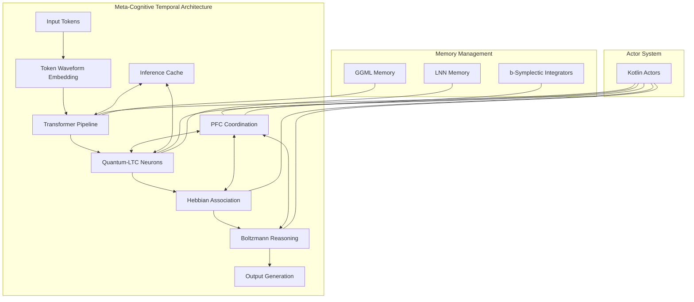
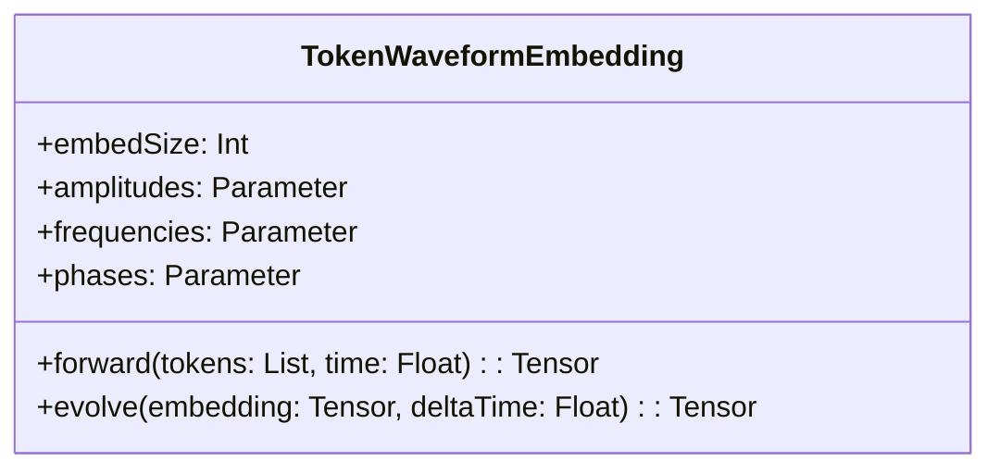
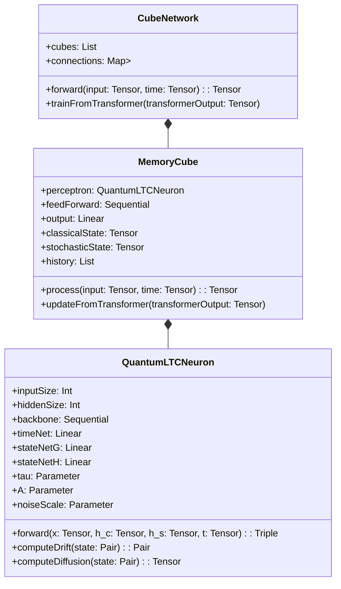
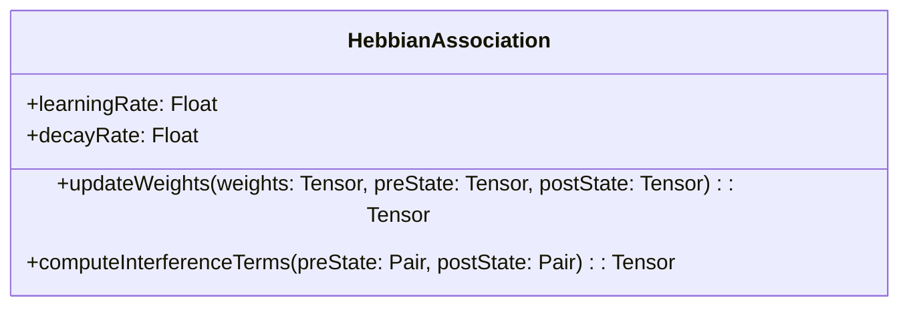
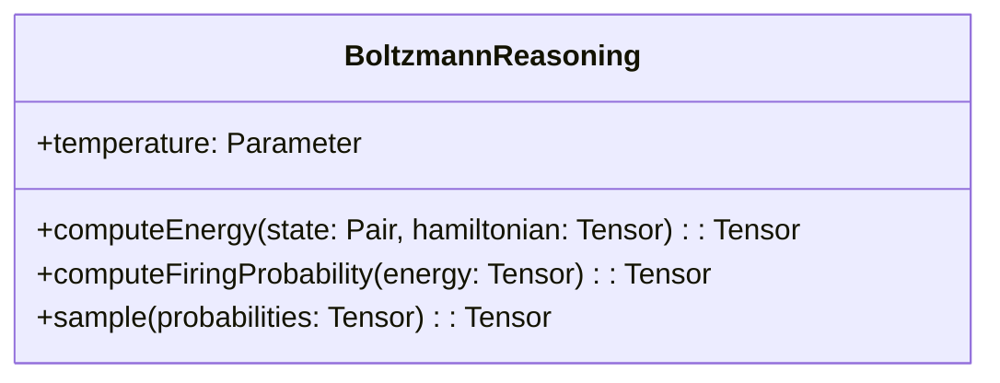
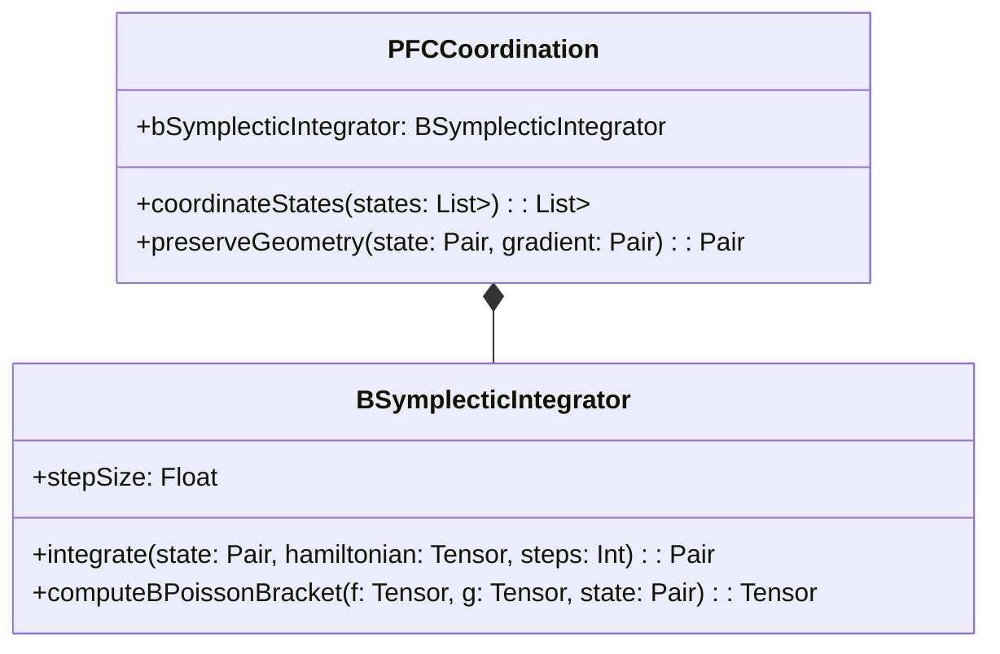
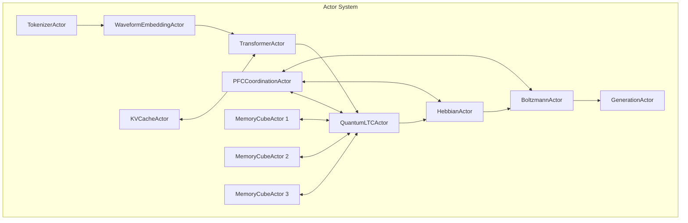
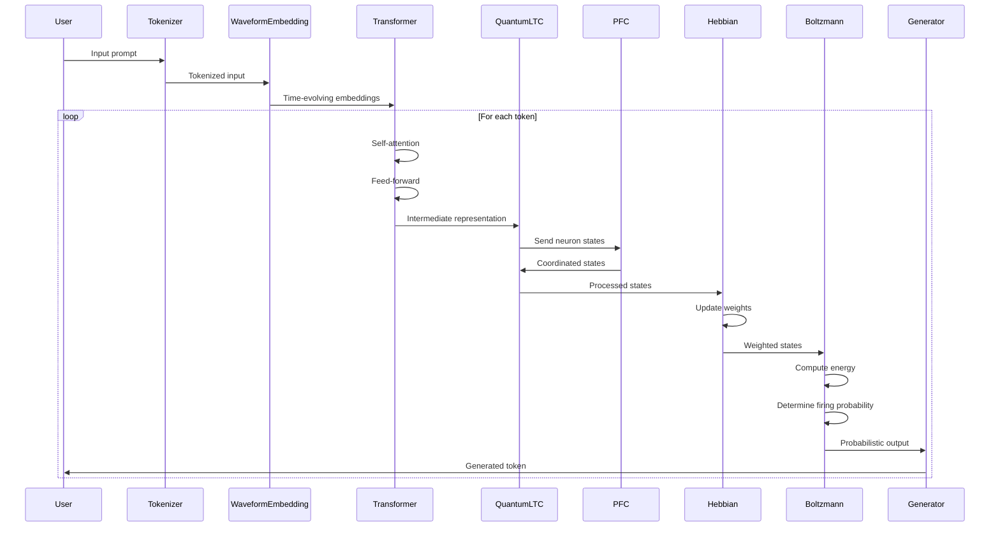

# Quantum-Classical Hybrid Framework: Meta-Cognitive Temporal Architecture (MCTA)

## Introduction

This document extends our [Hybrid Llama.cpp and Liquid Neural Networks design](hybrid-llama-lnn-design.md) with the **Meta-Cognitive Temporal Architecture (MCTA)**, a framework that fuses insights from quantum mechanics, nonlinear dynamics, and control theory to emulate adaptive, temporally causal cognition. By integrating Jacob Barandes' stochastic–quantum mapping and Eva Miranda's b-symplectic geometry into our neural models, we develop a hybrid quantum-classical approach that can be implemented efficiently in Kotlin using coroutines and actors.

## Core Design Principles

1. **Quantum-Classical Coherence**: Emulate quantum effects (superposition, interference) using classical stochastic differential equations
2. **Temporal Causality**: Implement time-evolving waveforms and adaptive time constants
3. **Geometric Integrity**: Preserve phase-space structure through b-symplectic integrators
4. **Actor-Based Computation**: Use Kotlin's actor model for parallel processing and message passing
5. **Coroutine-Friendly API**: Design all operations to be suspension-friendly and non-blocking

## System Architecture



## Mathematical Framework

### 1. Token Waveform Embedding: Harmonic Temporal Encoding

We convert static token embeddings into time-evolving waveforms:

$$
W_j(t) = A_j \sin\left(2\pi f_j t + \phi_j\right), \quad W(t) = \sum_{j=1}^d W_j(t)
$$

This encodes each token as a harmonic oscillation with learned parameters \( f_j \) and \( \phi_j \) that allow the system to align or desynchronize tokens over time.

### 2. LTC Neurons: Bridging Classical and Quantum Dynamics

#### Classical Dynamics

The classical Liquid Time Constant (LTC) neuron evolves its state \( h(t) \) according to:

$$
\frac{dh(t)}{dt} = \frac{1}{\tau} \left[ -h(t) + \sum_i w_i \, x_i(t) \right]
$$

#### Quantum Extension

We elevate the model by replacing \( h(t) \) with a qubit state \( |\psi(t)\rangle \) and define the Hamiltonian:

$$
i\hbar \frac{d}{dt} |\psi(t)\rangle = \hat{H}_{\text{LTC}} |\psi(t)\rangle, \quad \hat{H}_{\text{LTC}} = \frac{1}{\tau} \left( -\hat{I} + \sum_i w_i\, \hat{X}_i(t) \right)
$$

Using Barandes' stochastic–quantum theorem, we map this evolution to a classical stochastic differential equation:

$$
\frac{d}{dt} \begin{bmatrix} h_c(t) \\ h_s(t) \end{bmatrix} = \mathbf{A}(t) \begin{bmatrix} h_c(t) \\ h_s(t) \end{bmatrix} + \mathbf{B}(t)\,\eta(t)
$$

Where \( h_c(t) \) and \( h_s(t) \) are the real and stochastic (noise-driven) components, and \(\mathbf{A}(t)\) and \(\mathbf{B}(t)\) are matrices ensuring a unitary-like evolution.

### 3. Hebbian Association: Causal Weighting

To learn causal relationships, we employ a Hebbian update:

$$
\Delta w_{ij} = \eta\, h_i(t)\, h_j(t)
$$

When \( h_i(t) \) and \( h_j(t) \) derive from quantum states, their product includes interference terms, thus reinforcing entanglement-like correlations.

### 4. Boltzmann Probabilistic Reasoning: Energy-Based Decisions

Firing decisions are modeled probabilistically using a Boltzmann distribution:

$$
P(\text{fire}) \propto \exp\left(-\frac{E}{kT}\right)
$$

Where energy \( E \) is computed from both classical drift and stochastic noise.

### 5. PFC Coordination: Geometric Integrity via b-Symplectic Structures

The Prefrontal Cortex (PFC) module ensures global coordination by preserving phase-space structure using a **b-Poisson bracket**:

$$
\{f, g\}_b = \left(h_c^2 + h_s^2\right) \left( \frac{\partial f}{\partial h_c} \frac{\partial g}{\partial h_s} - \frac{\partial f}{\partial h_s} \frac{\partial g}{\partial h_c} \right)
$$

This bracket maintains quantum correlations and supports adaptive feedback, even as time constants evolve.

## Component Details

### 1. Token Waveform Embedding



### 2. Quantum-LTC Neurons



### 3. Hebbian Association



### 4. Boltzmann Reasoning



### 5. PFC Coordination



## Actor-Based Implementation

The MCTA framework is implemented using Kotlin's actor model for parallel processing:



## Kotlin Implementation

### 1. Token Waveform Embedding

```kotlin
class TokenWaveformEmbedding(
    val embedSize: Int,
    val contextSize: Int
) {
    // Learnable parameters
    val amplitudes = Parameter(shape = intArrayOf(embedSize))
    val frequencies = Parameter(shape = intArrayOf(embedSize))
    val phases = Parameter(shape = intArrayOf(embedSize))

    fun forward(tokens: List<Int>, time: Float): Tensor {
        val embeddings = lookupEmbeddings(tokens)
        return evolve(embeddings, time)
    }

    fun evolve(embedding: Tensor, time: Float): Tensor {
        // W_j(t) = A_j * sin(2π * f_j * t + φ_j)
        val timeFactors = computeTimeFactors(time)
        return embedding * timeFactors
    }

    private fun computeTimeFactors(time: Float): Tensor {
        // Calculate sin(2π * f_j * t + φ_j) for each dimension
        // Implementation using GGML operations
    }
}
```

### 2. Quantum-LTC Neuron

```kotlin
class QuantumLTCNeuron(
    val inputSize: Int,
    val hiddenSize: Int
) {
    // Neural networks
    val backbone = Sequential(
        Linear(inputSize + 2 * hiddenSize, hiddenSize),
        Tanh(),
        Linear(hiddenSize, hiddenSize)
    )
    val timeNet = Linear(hiddenSize, hiddenSize)
    val stateNetG = Linear(hiddenSize, hiddenSize)
    val stateNetH = Linear(hiddenSize, hiddenSize)

    // Learnable parameters
    val tau = Parameter(shape = intArrayOf(hiddenSize))
    val A = Parameter(shape = intArrayOf(hiddenSize))
    val noiseScale = Parameter(shape = intArrayOf(hiddenSize))

    fun forward(
        x: Tensor,
        h_c: Tensor,
        h_s: Tensor,
        t: Tensor
    ): Triple<Tensor, Tensor, Tensor> {
        // Combine input with classical and stochastic states
        val combined = concatenate(x, h_c, h_s)
        val features = backbone.forward(combined)

        // Compute drift and diffusion terms
        val (drift_c, drift_s) = computeDrift(Pair(h_c, h_s), features)
        val diffusion = computeDiffusion(Pair(h_c, h_s), features)

        // Update states using SDE
        val noise = generateCorrelatedNoise(h_c.shape)
        val h_c_new = h_c + drift_c * t + diffusion * noise * sqrt(t)
        val h_s_new = h_s + drift_s * t

        // Output is a combination of both states
        val output = h_c_new * cos(t) + h_s_new * sin(t)

        return Triple(output, h_c_new, h_s_new)
    }

    private fun computeDrift(state: Pair<Tensor, Tensor>, features: Tensor): Pair<Tensor, Tensor> {
        // Implementation of A(t) matrix from SDE
    }

    private fun computeDiffusion(state: Pair<Tensor, Tensor>, features: Tensor): Tensor {
        // Implementation of B(t) matrix from SDE
    }

    private fun generateCorrelatedNoise(shape: IntArray): Tensor {
        // Generate noise with correlation structure to emulate quantum effects
    }
}
```

### 3. Hebbian Association

```kotlin
class HebbianAssociation(
    val learningRate: Float,
    val decayRate: Float
) {
    fun updateWeights(weights: Tensor, preState: Tensor, postState: Tensor): Tensor {
        // Basic Hebbian update: Δw_ij = η * h_i * h_j
        val hebbian = preState.outerProduct(postState)

        // Add interference terms for quantum-like correlations
        val interference = computeInterferenceTerms(
            Pair(preState, preState * 0.1f),
            Pair(postState, postState * 0.1f)
        )

        return weights + learningRate * (hebbian + interference) - decayRate * weights
    }

    private fun computeInterferenceTerms(
        preState: Pair<Tensor, Tensor>,
        postState: Pair<Tensor, Tensor>
    ): Tensor {
        // Compute Re(ψ_i* ψ_j) like terms to capture quantum interference
    }
}
```

### 4. Boltzmann Reasoning

```kotlin
class BoltzmannReasoning(
    initialTemperature: Float
) {
    val temperature = Parameter(shape = intArrayOf(1), initialValue = initialTemperature)

    fun computeEnergy(state: Pair<Tensor, Tensor>, hamiltonian: Tensor): Tensor {
        // E = -Tr(ρ * H_LTC) + σ² * ||∇h||²
        val classicalEnergy = -(state.first * hamiltonian).sum()
        val gradientNorm = computeGradientNorm(state)
        return classicalEnergy + gradientNorm
    }

    fun computeFiringProbability(energy: Tensor): Tensor {
        // P(fire) ∝ exp(-E/kT)
        return exp(-energy / temperature)
    }

    fun sample(probabilities: Tensor): Tensor {
        // Sample binary decisions based on probabilities
    }

    private fun computeGradientNorm(state: Pair<Tensor, Tensor>): Tensor {
        // Compute ||∇h||² term
    }
}
```

### 5. PFC Coordination

```kotlin
class PFCCoordination(
    val stepSize: Float
) {
    val bSymplecticIntegrator = BSymplecticIntegrator(stepSize)

    fun coordinateStates(states: List<Pair<Tensor, Tensor>>): List<Pair<Tensor, Tensor>> {
        // Ensure geometric consistency across multiple neuron states
        return states.map { state ->
            val hamiltonian = computeEffectiveHamiltonian(states)
            bSymplecticIntegrator.integrate(state, hamiltonian, steps = 1)
        }
    }

    private fun computeEffectiveHamiltonian(states: List<Pair<Tensor, Tensor>>): Tensor {
        // Compute effective Hamiltonian for the system
    }
}

class BSymplecticIntegrator(
    val stepSize: Float
) {
    fun integrate(
        state: Pair<Tensor, Tensor>,
        hamiltonian: Tensor,
        steps: Int
    ): Pair<Tensor, Tensor> {
        var currentState = state
        repeat(steps) {
            val (h_c, h_s) = currentState

            // Compute gradients using b-Poisson bracket
            val dh_c = computeBPoissonBracket(hamiltonian, h_s, currentState)
            val dh_s = -computeBPoissonBracket(hamiltonian, h_c, currentState)

            // Update using symplectic Euler method
            val h_c_new = h_c + stepSize * dh_c
            val h_s_new = h_s + stepSize * dh_s

            currentState = Pair(h_c_new, h_s_new)
        }
        return currentState
    }

    fun computeBPoissonBracket(
        f: Tensor,
        g: Tensor,
        state: Pair<Tensor, Tensor>
    ): Tensor {
        val (h_c, h_s) = state
        val factor = h_c * h_c + h_s * h_s

        // {f,g}_b = (h_c² + h_s²) * (∂f/∂h_c * ∂g/∂h_s - ∂f/∂h_s * ∂g/∂h_c)
        val df_dhc = gradient(f, h_c)
        val dg_dhs = gradient(g, h_s)
        val df_dhs = gradient(f, h_s)
        val dg_dhc = gradient(g, h_c)

        return factor * (df_dhc * dg_dhs - df_dhs * dg_dhc)
    }
}
```

## Actor Implementation

```kotlin
// Example actor implementation for Quantum-LTC Neuron
fun CoroutineScope.quantumLTCNeuronActor(
    neuronId: Int,
    inputChannel: Channel<Tensor>,
    outputChannel: Channel<Tensor>,
    pfcChannel: Channel<Pair<Tensor, Tensor>>
) = actor<QuantumLTCMessage> {
    val neuron = QuantumLTCNeuron(inputSize = 512, hiddenSize = 1024)
    var h_c = Tensor.zeros(intArrayOf(1, neuron.hiddenSize))
    var h_s = Tensor.zeros(intArrayOf(1, neuron.hiddenSize))
    var t = 0.0f

    for (msg in channel) {
        when (msg) {
            is Process -> {
                // Update time
                t += msg.deltaTime

                // Process input through neuron
                val (output, h_c_new, h_s_new) = neuron.forward(
                    msg.input, h_c, h_s, Tensor.scalar(t)
                )

                // Update states
                h_c = h_c_new
                h_s = h_s_new

                // Send state to PFC for coordination
                pfcChannel.send(Pair(h_c, h_s))

                // Send output
                outputChannel.send(output)
            }
            is UpdateFromPFC -> {
                // Update states based on PFC coordination
                h_c = msg.newState.first
                h_s = msg.newState.second
            }
            is SaveState -> {
                // Save neuron state
                msg.response.complete(Pair(h_c, h_s))
            }
        }
    }
}

// Example actor implementation for PFC Coordination
fun CoroutineScope.pfcCoordinationActor(
    neuronChannels: List<Channel<Pair<Tensor, Tensor>>>,
    outputChannels: List<Channel<Pair<Tensor, Tensor>>>
) = actor<PFCMessage> {
    val pfc = PFCCoordination(stepSize = 0.01f)
    val states = MutableList(neuronChannels.size) {
        Pair(Tensor.zeros(intArrayOf(1, 1024)), Tensor.zeros(intArrayOf(1, 1024)))
    }

    for (msg in channel) {
        when (msg) {
            is Coordinate -> {
                // Collect states from all neurons
                for (i in neuronChannels.indices) {
                    states[i] = neuronChannels[i].receive()
                }

                // Coordinate states using b-symplectic geometry
                val coordinatedStates = pfc.coordinateStates(states)

                // Send coordinated states back to neurons
                for (i in outputChannels.indices) {
                    outputChannels[i].send(coordinatedStates[i])
                }
            }
        }
    }
}
```

## Unified Workflow

The complete MCTA workflow integrates all components:



## Coroutine-Friendly API

The API is designed to be fully compatible with Kotlin coroutines:

```kotlin
interface QuantumClassicalHybridLLM {
    // Non-blocking token generation with time-evolving embeddings
    suspend fun generate(
        prompt: String,
        maxTokens: Int,
        temperature: Float = 1.0f
    ): Flow<Token>

    // Stream completions with backpressure support
    fun streamCompletions(
        prompt: String,
        temperature: Float = 1.0f
    ): Flow<Completion>

    // Batched processing
    suspend fun processBatch(
        prompts: List<String>,
        temperature: Float = 1.0f
    ): List<Completion>

    // Memory management
    suspend fun clearMemory()
    suspend fun saveState(path: String)
    suspend fun loadState(path: String)

    // Quantum-classical specific methods
    suspend fun adjustQuantumInfluence(scale: Float)
    suspend fun setTemporalEvolutionRate(rate: Float)
}
```

## Performance Considerations

1. **Stochastic Simulation Efficiency**: Optimize the generation of correlated noise
2. **b-Symplectic Integration**: Implement efficient numerical integrators for geometric preservation
3. **Memory Management**: Careful management of both classical and stochastic state components
4. **Computation Scheduling**: Efficient scheduling of computation across actors
5. **Native Acceleration**: Use of platform-specific acceleration for matrix operations

## Conclusion

The Meta-Cognitive Temporal Architecture (MCTA) extends our hybrid Llama.cpp and LNN design with quantum-inspired mathematics and b-symplectic geometry. By implementing this framework in Kotlin with full support for actors and coroutines, we create a system that emulates quantum phenomena (superposition, interference, entanglement) on classical hardware while maintaining the efficiency of Llama.cpp's inference engine.

The integration of token waveform embeddings, quantum-extended LTC neurons, Hebbian association, Boltzmann reasoning, and PFC coordination with b-symplectic structures provides a comprehensive framework for adaptive, temporally causal cognition. This approach enables more sophisticated temporal processing and causal reasoning than traditional neural networks, while remaining implementable on classical hardware.

This design represents a significant advancement in neural computation that could enable more efficient and adaptive language models, particularly for applications that require continuous learning, temporal reasoning, and adaptation to changing environments.
